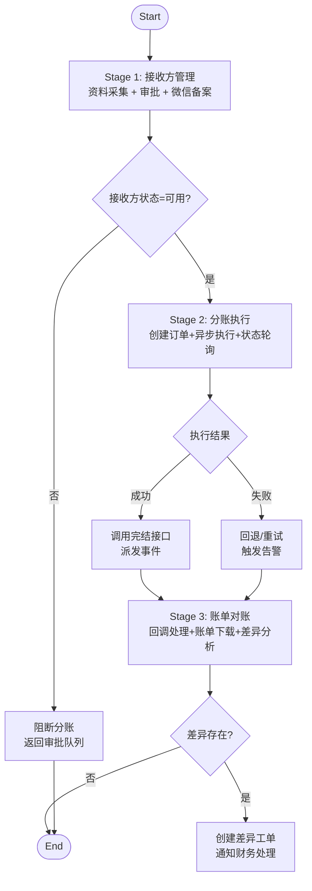

# FRD 01：分账愿景与全局蓝图

> 本篇定义微信支付分账接入的顶层愿景、范围与阶段化策略，是后续专题FRD（02/03/04）的约束与前提。

## 📊 快速概览
| 项目 | 信息 |
| --- | --- |
| **ID** | `wechat-pay-profit-share-bundle:01-overview@v1.0` |
| **阶段** | `🔵需求` → `🟢设计` → `⚪任务` → `⚪实施` → `⚪验证` |
| **目标版本** | `2025Q1` |
| **负责人** | `wechat-pay-domain` |
| **相关FRD** | `02_接入前准备与接收方管理`, `03_分账执行与回退闭环`, `04_账单对账与运维响应` |

---

## 1️⃣ 愿景与业务动机
- **业务背景**：平台采用服务商模式为多商户提供支付能力。现有 `WechatPayBundle` 已覆盖支付、退款、账单，但缺少官方分账功能，导致渠道分润、平台抽佣只能线下结算。
- **愿景声明**：构建一体化的“分账前置审核 → 分账执行 → 回退与完结 → 账单核对”闭环能力，确保资金分配合规、透明、可追溯。
- **业务价值**：
  - 支撑平台化业务模式（SaaS分润、B2B2C渠道佣金、运营活动分成）。
  - 提供合规化审计链路，满足财务与风控监管要求。
  - 提高运营效率，减少手工对账、线下回退的错误率。

---

## 2️⃣ 范围边界与递进路线
| 阶段 | 描述 | 依赖 | 对应FRD |
| --- | --- | --- | --- |
| **Stage 1：接入准备** | 校验商户证书、渠道配置，建立接收方信息管理与审批 | Merchant 配置、证书管理 | `02_接入前准备与接收方管理` |
| **Stage 2：执行闭环** | 发起分账、状态轮询、回退与完结，全链路幂等与告警 | Stage 1 完成，消息中间件可用 | `03_分账执行与回退闭环` |
| **Stage 3：账单对账** | 回调验签、账单下载、差异识别、运维告警 | Stage 2 稳定运行，储存与日志可用 | `04_账单对账与运维响应` |

**范围内**：
- 微信支付官方分账能力（服务商模式 v3 API）。
- Doctrine 实体、Messenger 队列、控制台命令、领域事件。
- Prometheus 指标、结构化日志、分账差异告警。

**范围外**：
- 上层业务的收益分配策略与审批流程（提供接口对接）。
- 其他支付渠道分账（如支付宝、银联），留待后续评估。
- 历史分账数据迁移（需独立项目处理）。

---

## 3️⃣ 角色矩阵与责任划分
| 角色 | 职责 | 输出物 |
| --- | --- | --- |
| **产品负责人** | 定义业务场景、分润规则、审批人 | 分账策略文档、审批配置 |
| **技术负责人** | 主导架构设计、质量门约束 | FRD 02/03/04、技术方案、回滚策略 |
| **财务运营** | 审核接收方、处理差异账单 | 审批记录、差异处理单 |
| **安全合规** | 审查敏感数据存储与访问 | 加密策略、访问审计 |
| **运维** | 监控任务、处理告警、执行回滚 | Runbook、监控面板 |

**协作准则**：每个阶段在进入下一阶段前必须完成关联角色的评审与签字；任何例外需创建“例外卡”登记Owner、范围与到期日。

---

## 4️⃣ 关键业务流程（Mermaid）

---

## 5️⃣ 阶段性里程碑与质量门
| 里程碑 | 描述 | 验收标准 | 前置质量门 |
| --- | --- | --- | --- |
| M1：接收方管理上线 | 完成实体/服务/API/后台 | 沙箱新增接收方→微信备案成功 | PHPStan + PHPUnit(接收方) |
| M2：分账执行闭环 | 支持分账、回退、完结 | 沙箱执行分账→回退→完结流程通过 | PHPStan + PHPUnit + 功能测试 |
| M3：账单与通知 | 回调验签、账单对账、告警 | 模拟回调+下载账单→差异报告0误差 | PHPStan + 集成测试 + 指标验证 |
| M4：生产灰度 | 选定子商户灰度运行1周 | 差异率<0.1%，告警及时响应 | 全路径质量门 |

**质量门总则**：
- 所有命令、测试、静态分析均限定 `packages/wechat-pay-profit-share-bundle`。
- 任何Bug修复必须具备“先红后绿”的回归测试。
- 自动修复/重构后必须重新跑全量质量门。

---

## 6️⃣ 风险清单与回滚策略
| 风险 | 影响 | 缓解措施 | 回滚策略 |
| --- | --- | --- | --- |
| 证书/密钥配置错误 | 分账API失败 | Stage 1 引入证书有效性自检命令 | 下线功能开关，回滚至上个tag |
| 接收方资料泄露 | 合规风险 | 字段级加密、访问审计、最小权限 | 立即冻结接收方接口，启动事件响应 |
| 分账执行幂等失效 | 重复打款 | 业务幂等键 + 微信幂等键 + 唯一索引 | 使用补偿接口回退，人工财务确认 |
| 账单差异不上报 | 财务损失 | 差异告警、日常巡检 | 回滚账单处理任务，手工对账 |

全局回滚：提供 `FEATURE_PROFIT_SHARE_ENABLED` 特性开关；如需紧急停用，关闭开关并清理待执行队列，保留数据库数据以便追溯。

---

## 7️⃣ 未决事项
1. 分润规则由平台统一管理还是各业务自定义？影响分账指令接口设计。
2. 财务审批是否需与外部系统（例如ERP）打通？决定接收方审批流程集成方式。
3. 分账消息队列使用现有 `messenger` 还是新建独立通道？涉及吞吐与隔离策略。
4. 是否需要支持“延迟分账”（支付后若干天才执行）？需确认业务场景与合规限制。

> 以上未决项需在进入FRD 02设计评审前完成裁决，否则Stage 2/3将延后。
