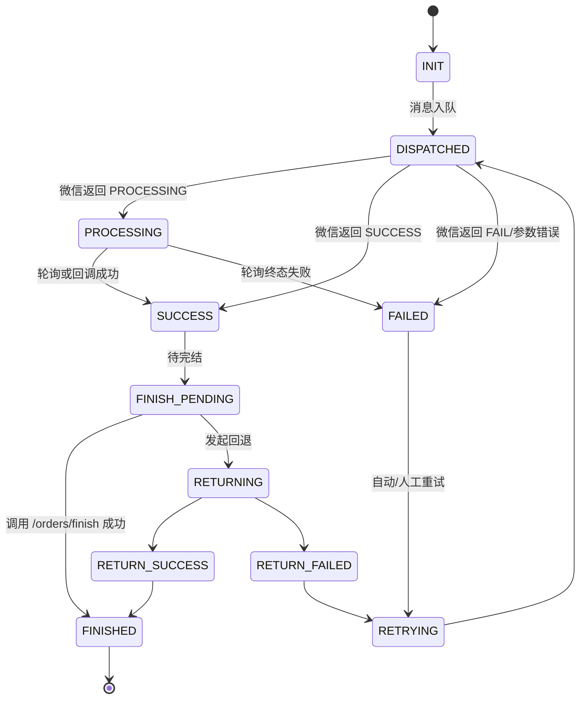

# FRD 03：分账执行与回退闭环

> 阶段目标：在完成 Stage 1（FRD 02）后，构建分账执行、状态跟踪、回退与完结的全链路能力，确保资金按业务约定进行归属。

## 📊 快速概览
| 项目 | 信息 |
| --- | --- |
| **ID** | `wechat-pay-profit-share-bundle:03-execution@v1.0` |
| **阶段** | `🔵需求` → `🟢设计` → `⚪任务` → `⚪实施` → `⚪验证` |
| **覆盖范围** | 分账指令、异步处理、状态轮询、回退、完结、领域事件 |
| **依赖** | `FRD 02` 接收方可用状态、`WechatPayBundle` 支付订单、Messenger 队列 |

---

## 1️⃣ 分账触发与指挥链
- **触发条件**：
  - 支付订单（`PayOrder`）状态为 `PAID` 或 `SUCCESS`。
  - 业务侧提供的分账策略达到执行条件（履约确认、服务完成等）。
  - 所有接收方状态为 `AVAILABLE`（来自 FRD 02）。
- **指挥链**：
  1. 上层业务调用 `DispatchProfitShareCommand`。
  2. `ProfitShareCommandService` 校验策略、金额、幂等键，并持久化 `ProfitShareOrder`。
  3. 发布 `ProfitShareExecuteMessage` 至 Messenger 队列。
  4. 消费者调用 `/v3/profitsharing/orders`（服务商接口），记录响应状态并触发后续流程。
- **幂等键**：`{partner_mch_id}:{sub_mchid}:{out_trade_no}:{out_order_no}`，数据库唯一索引 + 微信幂等键双保险。

---

## 2️⃣ 分账状态机与消息流

- **消息通道**：
  - `ProfitShareExecuteMessage`：异步执行分账。
  - `ProfitShareQueryMessage`：处理 PROCESSING 状态轮询。
  - `ProfitShareReturnMessage`：执行回退。
  - `ProfitShareFinishMessage`：执行完结。
- **轮询策略**：首次间隔60秒，随后按照 2^n * 60 秒（最大 10 分钟）退避，最多 10 次；超过阈值触发人工介入告警。

---

## 3️⃣ 数据持久化与幂等策略
- **实体**：
  - `ProfitShareOrder`：订单主表，包含原支付单信息、状态、剩余金额、重试计数。
  - `ProfitShareOrderItem`：分账明细（接收方、金额、描述、比例、状态、回退标记）。
  - `ProfitShareReturnOrder`：回退记录，关联原分账单。
  - `ProfitShareOperationLog`：记录所有状态变更、调用结果、操作者。
- **数据一致性**：
  - 所有状态写操作统一通过仓储层，使用事务确保主表与明细同步。
  - 幂等调用基于唯一索引和乐观锁（版本号）组合实现，避免重复执行。
- **残余金额管理**：
  - 每次成功分账后同步更新剩余可分金额，写入 `remaining_amount`。
  - 回退成功后恢复剩余金额，供后续分账或完结校验。

---

## 4️⃣ 回退、完结与补偿流程
- **分账回退**：
  - API：`POST /v3/profitsharing/return-orders`，查询接口 `GET /v3/profitsharing/return-orders/{out_return_no}`。
  - 触发方式：业务主动、执行失败、接收方冻结、运营手动。
  - 回退成功：更新 `ProfitShareOrderItem` 状态为 `RETURNED`，回退单状态为 `SUCCESS`。
- **分账完结**：
  - 前置条件：所有明细为 `SUCCESS` 且无回退中任务，剩余金额明确（可能为0）。
  - API：`POST /v3/profitsharing/orders/finish`。
  - 完结失败策略：自动重试3次；仍失败则保持 `FINISH_PENDING`，触发告警。
- **补偿机制**：
  - 系统繁忙/限流：指数退避，最大5次，超过后手工处理。
  - 不可逆失败（参数错误、接收方状态异常）：直接标记 `FAILED`，触发业务事件与告警，由运营决定是否回退。

---

## 5️⃣ 服务接口与任务编排
- **应用服务**：
  - `ProfitShareCommandService::dispatch(DispatchProfitShareCommand $command)`。
  - `ProfitShareReturnService::requestReturn(ReturnProfitShareCommand $command)`。
  - `ProfitShareFinishService::finish(FinishProfitShareCommand $command)`。
- **消息处理器**：
  - `ProfitShareExecuteHandler`：消费分账执行消息，封装 HTTP 请求、签名、异常兜底。
  - `ProfitShareQueryHandler`：运行在 `auto-push` 定时任务内，处理 PROCESSING 状态。
  - `ProfitShareReturnHandler`：执行回退逻辑。
  - `ProfitShareFinishHandler`：执行完结。
- **控制台命令**：
  - `wechat:profit-share:dispatch --order=<id>`：手动重放或触发分账。
  - `wechat:profit-share:retry --status=FAILED --limit=50`：批量加入重试队列。
  - `wechat:profit-share:finish --order=<id>`：人工完结。
- **领域事件**（供外部系统订阅）：
  - `ProfitShareSucceededEvent`、`ProfitShareFailedEvent`、`ProfitShareReturnedEvent`、`ProfitShareFinishedEvent`。

---

## 6️⃣ 质量验证与监控指标
- **质量门**：
  - 静态分析：`phpstan --level=max packages/wechat-pay-profit-share-bundle`.
  - 单元测试：金额校验、状态机转换、幂等策略、错误分类。
  - 集成测试：结合 MockServer 模拟微信接口各类响应。
  - 负载测试：模拟 500 tps 分账请求，验证队列与数据库性能。
- **监控指标**：
  - `profit_share_execute_total{status}`、`profit_share_return_total{status}`。
  - `profit_share_retry_total{reason}`、`profit_share_finish_total{status}`。
  - `profit_share_processing_age_seconds`（PROCESSING 状态持续时间）。
- **日志与告警**：
  - 结构化字段：`order_no`、`transaction_id`、`receiver_id`、`status`、`retry_count`。
  - 告警阈值：失败率>1% 触发告警；PROCESSING 超过30分钟触发升级。

---

## 7️⃣ 风险与回滚
| 风险 | 影响 | 缓解 | 回滚策略 |
| --- | --- | --- | --- |
| 幂等键冲突 | 分账重复执行 | 唯一索引+乐观锁，异常时记录告警 | 手工回退重复资金 |
| 队列堵塞 | 大量订单堆积 | 队列监控、自动扩容消费者 | 暂停执行特性，排空队列 |
| 回退失败 | 资金挂账 | 自动重试 + 告警 | 财务手工处理，记录差异 |
| 完结失败 | 订单无法终态 | 重试机制 + 手工命令 | 暂停完结，等待微信支持 |

全局回滚：关闭 `profit_share_execution` 特性后，停止分账执行；对处于 PROCESSING 的订单人工处理，保留操作日志以供审计。

---

## 8️⃣ 未决事项
1. 是否支持“延迟分账”（例如T+1/T+7执行）？决定是否需要任务调度扩展。
2. 领域事件是否需要可靠消息（Outbox）保证？需结合平台事件总线策略。
3. 分账失败的人工审批流程如何与运营系统集成？决定事件回调形态。
4. 是否需要支持“比例+固定金额混合分账”？影响金额校验逻辑。

> 完成上述事项后方可进入开发任务 E-01（实体与迁移）。
