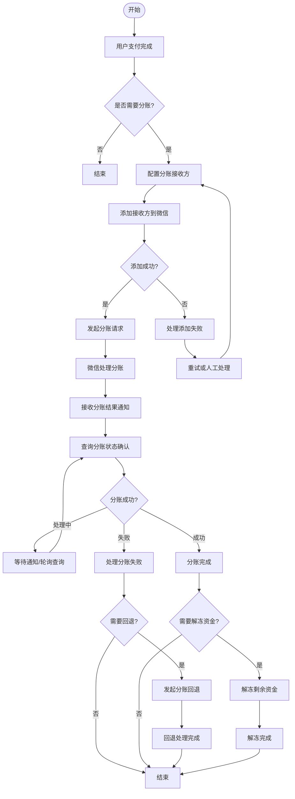
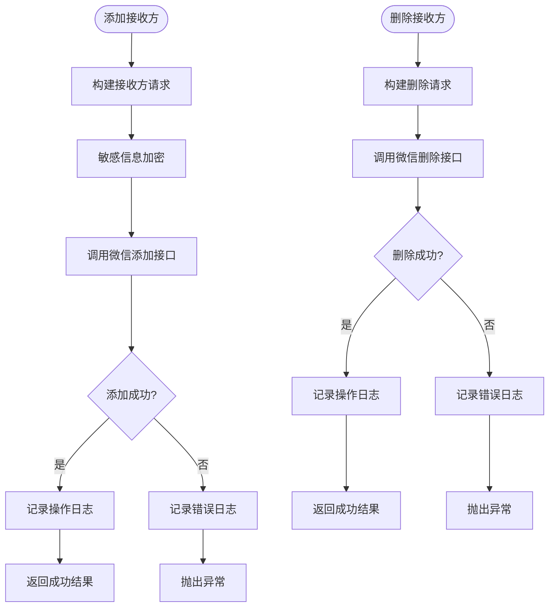
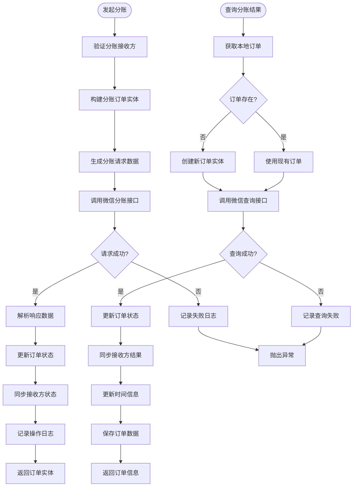
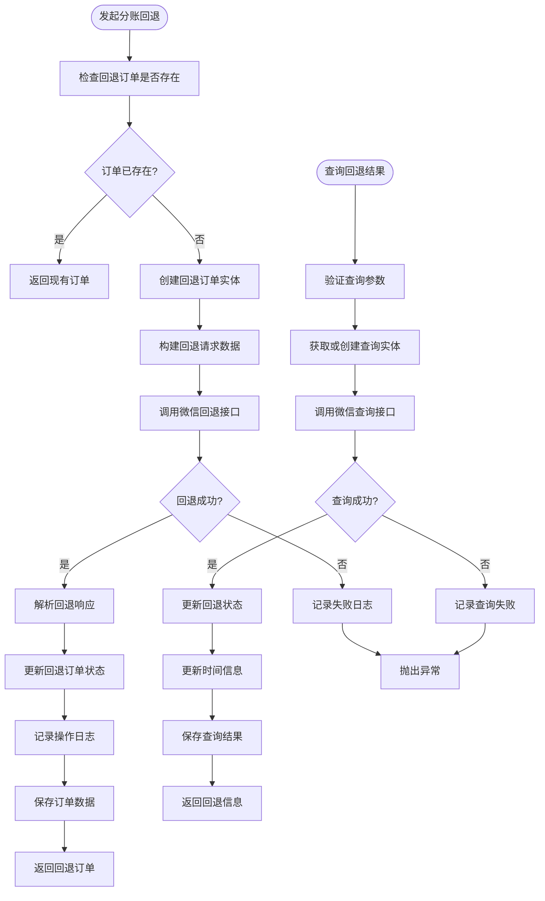
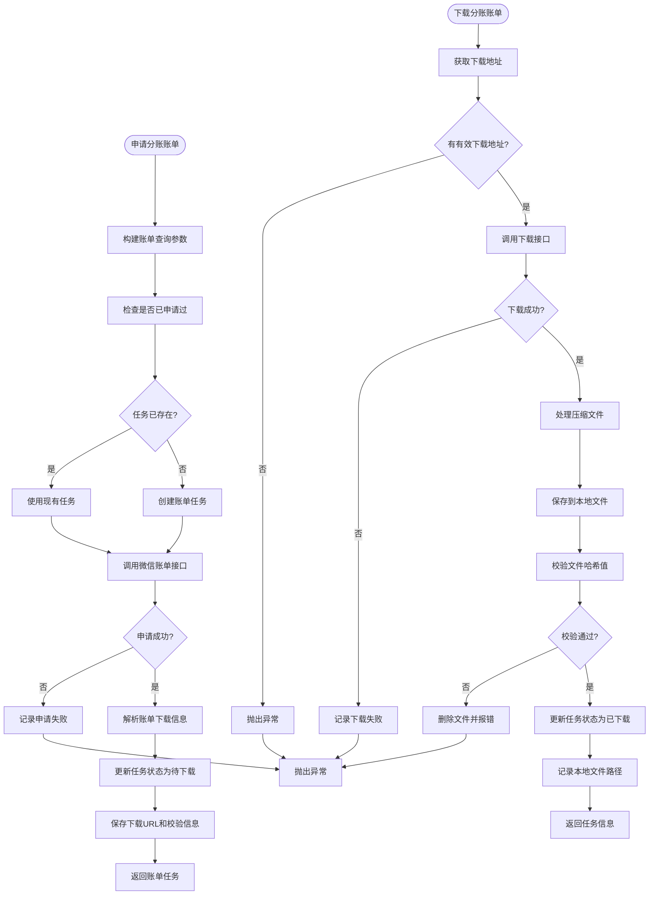
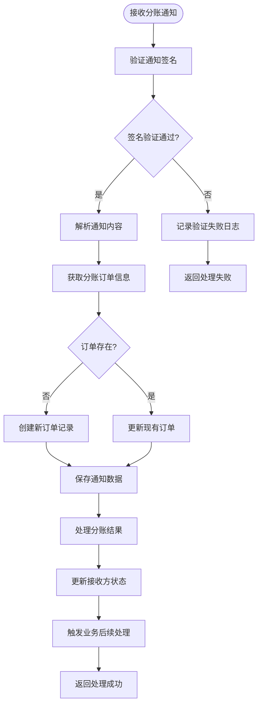
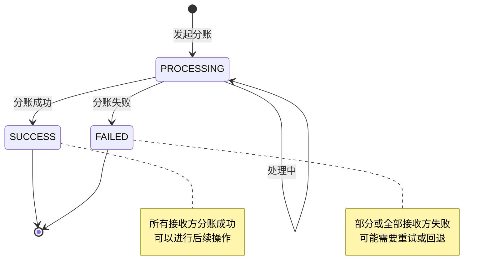
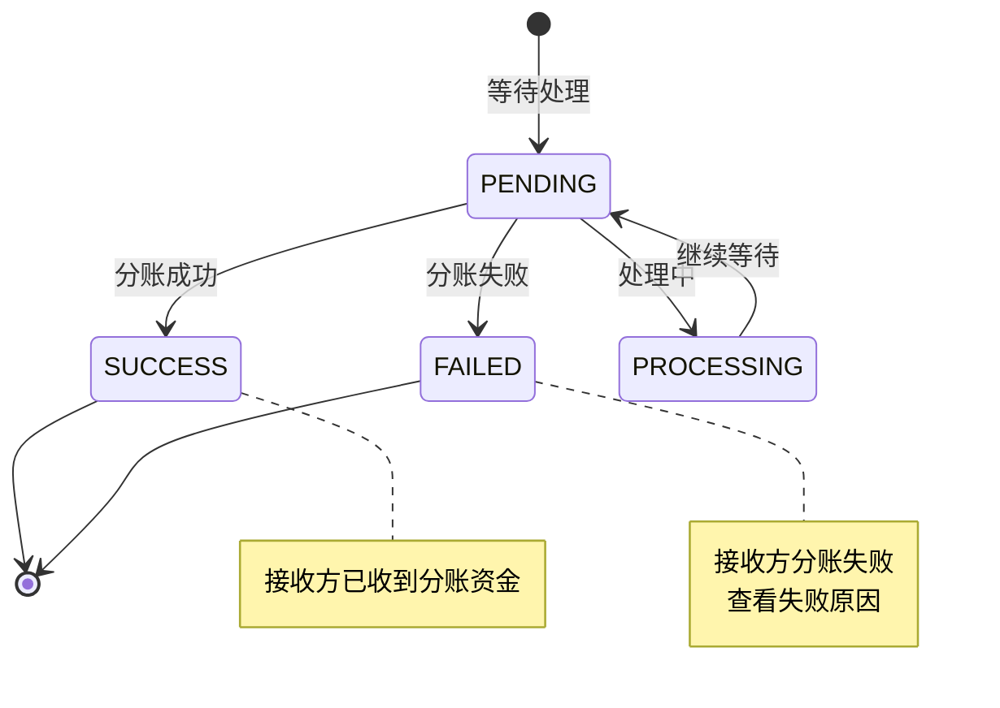

# 微信支付分账业务流程图

## 概述

微信支付分账（Profit Sharing）是微信支付为商户提供的资金分配服务，允许商户将收款后的资金分配给多个接收方。本文档基于 `wechat-pay-profit-share-bundle` 实现，梳理完整的业务流程。

## 核心业务模块

### 1. 分账接收方管理 (ProfitShareReceiverService)
- **添加接收方** (`addReceiver`): 将分账接收方添加到微信支付系统
- **删除接收方** (`deleteReceiver`): 从微信支付系统移除分账接收方

### 2. 分账订单管理 (ProfitShareService)  
- **请求分账** (`requestProfitShare`): 发起分账请求
- **查询分账结果** (`queryProfitShareOrder`): 查询分账订单状态
- **解冻剩余资金** (`unfreezeRemainingAmount`): 解冻未分账的资金

### 3. 分账回退管理 (ProfitShareReturnService)
- **请求回退** (`requestReturn`): 将已分账资金回退
- **查询回退结果** (`queryReturn`): 查询回退订单状态

### 4. 分账账单管理 (ProfitShareBillService)
- **申请账单** (`applyBill`): 申请分账账单下载
- **下载账单** (`downloadBill`): 下载分账账单文件

### 5. 分账配置查询 (ProfitShareConfigurationService)
- **查询剩余金额** (`queryRemainingAmount`): 查询可分账剩余金额
- **查询最大分账比例** (`queryMaxRatio`): 查询分账比例限制

### 6. 通知处理 (ProfitShareNotificationService)
- **处理分账通知** (`handleNotification`): 处理微信支付的分账结果通知

## 业务流程图

### 整体业务流程概览



### 分账接收方管理流程



### 分账订单处理流程



### 分账回退流程



### 分账账单处理流程



### 通知处理流程



## 状态流转

### 分账订单状态



### 接收方结果状态



## 关键技术点

### 1. 安全机制
- **敏感信息加密**: 接收方姓名使用RSA加密
- **签名验证**: 通知回调需要验证微信支付签名
- **数据校验**: 账单文件下载后进行哈希校验

### 2. 幂等性处理
- 所有操作基于业务单号(`out_order_no`, `out_return_no`)进行幂等控制
- 重复请求返回已存在的订单实体

### 3. 异步处理
- 分账请求异步处理，需要通过通知或主动查询获取结果
- 支持轮询查询机制确认最终状态

### 4. 错误处理
- 完整的操作日志记录
- 详细的错误信息和错误码记录
- 支持重试机制

## API接口映射

| 功能模块 | 微信支付API | 本服务方法 |
|---------|------------|-----------|
| 添加分账接收方 | POST /v3/profitsharing/receivers/add | `addReceiver()` |
| 删除分账接收方 | POST /v3/profitsharing/receivers/delete | `deleteReceiver()` |
| 请求分账 | POST /v3/profitsharing/orders | `requestProfitShare()` |
| 查询分账结果 | GET /v3/profitsharing/orders/{out_order_no} | `queryProfitShareOrder()` |
| 请求分账回退 | POST /v3/profitsharing/return-orders | `requestReturn()` |
| 查询分账回退 | GET /v3/profitsharing/return-orders/{out_return_no} | `queryReturn()` |
| 解冻剩余资金 | POST /v3/profitsharing/orders/unfreeze | `unfreezeRemainingAmount()` |
| 申请分账账单 | GET /v3/profitsharing/bills | `applyBill()` |
| 查询分账配置 | GET /v3/profitsharing/merchant-configs/{sub_mchid} | `queryConfiguration()` |

## 监控与日志

### 关键监控指标
- 分账请求成功率
- 分账处理延迟时间  
- 接收方添加/删除成功率
- 账单下载成功率
- 通知处理成功率

### 日志记录要点
- 每个API调用的请求和响应数据
- 操作耗时统计
- 错误码和错误信息
- 业务状态变更记录

## 使用示例

### 基本分账流程

```php
// 1. 添加分账接收方
$receiverService->addReceiver($merchant, $addRequest);

// 2. 发起分账
$order = $profitService->requestProfitShare($merchant, $orderRequest);

// 3. 查询分账结果
$result = $profitService->queryProfitShareOrder(
    $merchant, 
    $subMchId, 
    $outOrderNo, 
    $transactionId
);

// 4. 如需解冻剩余资金
$profitService->unfreezeRemainingAmount($merchant, $unfreezeRequest);
```

此文档完整梳理了微信支付分账业务的流程，可作为开发和运维参考文档使用。